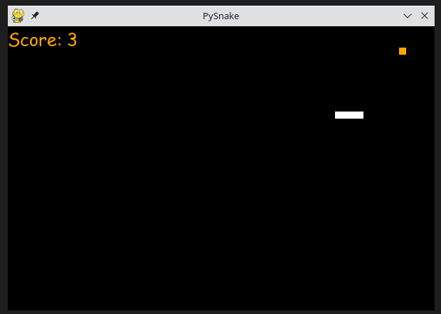

# Pysnake

## _Yet another Snake game in Python_

A simple Snake game using PyGame library.

## Objectives

Use of a python library to develop a basic game with the objective to learn and improve my skills in:

* Python development and good practices;
* Refactoring a simple code to use Objects and Methods
* Improve the readability of some documentations
* Usage of Git and GitHub

## Dependencies

* pygame

    pip install pygame

